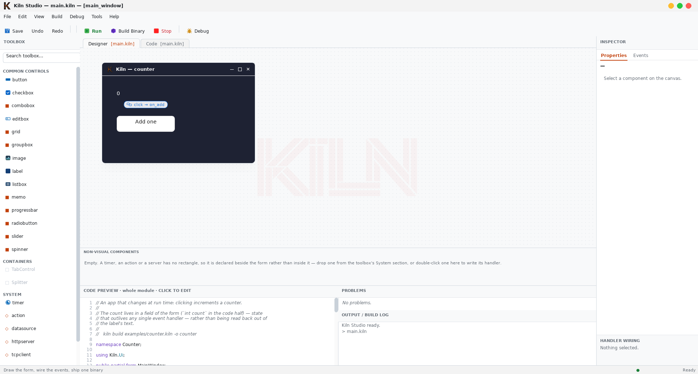
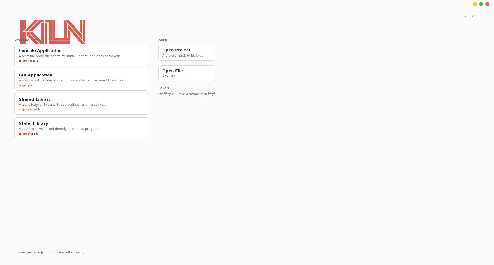
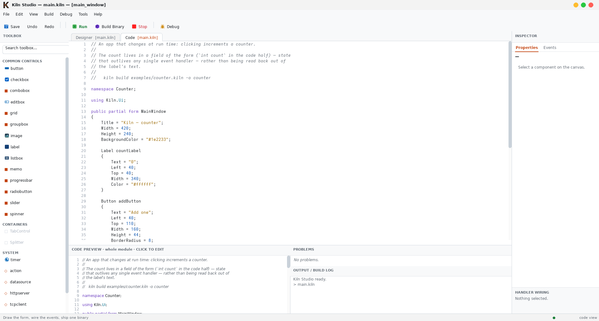
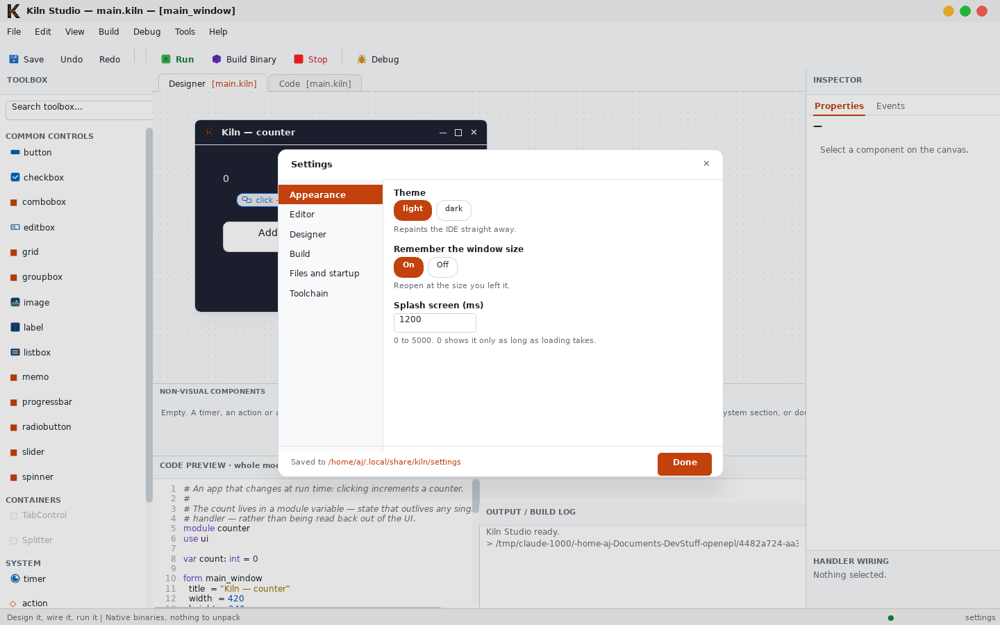

<div align="center">


**Draw an app. Wire an event. Ship a native binary.**

A C#-shaped language that compiles to native code — no runtime to install, no
.NET, nothing to unpack — and a form you draw is the source.

**[Documentation](https://axdsan.github.io/kiln/)** · [Quick start](#quick-start) ·
[Build targets](#one-project-every-artifact) · [Editor support](#editor-support) ·
[Building from source](#building-from-source) · [Versioning](#versioning) ·
[Status](#status)

</div>

---

## What it is

Kiln is an IDE and a compiler that belong together. You lay a form out
visually, set properties in an inspector, wire a button's click to a method,
and press **Run** — and what comes out the other side is an ordinary native
binary you can hand to someone.

Kiln 2 reads like C#: braces, `namespace`, `var`, classes and records with
methods, interfaces, generics, lambdas, `List<T>` and `Dictionary<K,V>`,
`$"…"` interpolation, and `T?` for a value that may be absent. It compiles
ahead of time to a native binary — no virtual machine, no reflection, no
metadata in the binary. Positions count from 1; byte offsets count from 0.
A form is a `partial form`: Studio owns one half, you write the other.

```k2
namespace Hello;

public static class Program
{
    public static void Main()
    {
        List<string> names = ["ada", "grace"];
        foreach (var n in names)
            Console.WriteLine($"hello, {n}");
    }
}
```

Kiln 1.x programs still build, with a deprecation note (`--1x` silences it),
and `kiln migrate` converts one to Kiln 2.

<div align="center">

</div>

## Quick start

Download a release, unpack it anywhere, and run it — there is no installer and
nothing to configure:

```sh
tar xzf kiln-2.1.1-linux-x86_64.tar.gz
cd kiln-2.1.1-linux-x86_64
bin/kiln-studio
```

Studio opens on a welcome screen. Pick a project kind and it is created and
opened for you.

<div align="center">

</div>

From the command line:

```sh
bin/kiln templates                 # what you can create
bin/kiln new gui-app my-app        # create a project
bin/kiln run my-app/main.kiln       # build it and run it
```

A first program is as short as it looks:

```
module hello
target console

sub main
  call print_text("Hello from Kiln.")

  let answer: int = 6 * 7
  call print_text("six times seven is {answer}")
end
```

A program that waits — for a tick, a click or an HTTP request — declares the
component that wakes it and stays in the runtime's event loop after `main`
returns:

```
module countdown
target console

var remaining: int = 3

timer tick_source
  interval = 500
  on tick: on_tick
end

sub main
  call print_text("3...")
end

sub on_tick
  remaining -= 1
  if remaining <= 0
    call print_text("Liftoff.")
    call quit()
  else
    call print_text("{remaining}...")
  end
end
```

Beyond that: 16 bundled kits — `file`, `text`, `json`, `xml`, `net`, `db`
and the rest — 397 commands and 21 components, and `use <name>` is the whole
of asking for a kit. `kiln commands --use <name>` lists what each adds;
the [Commands](https://axdsan.github.io/kiln/docs/reference-commands.html)
reference is generated from the same answer.

## One project, every artifact

The same source builds as any of these. It is a build option, not a rewrite:

| `target` | Produces |
| --- | --- |
| `console` | a terminal program |
| `gui` | a windowed program |
| `sharedlib` | `.so` (`.dll` / `.dylib` elsewhere) |
| `staticlib` | `.a` archive |

Declare it in the module, or override it per build with `--target`. Left out,
a module with a form is a GUI program and anything else is a console one.

```sh
kiln build lib.kiln --target sharedlib -o libgreet.so
```

Libraries export the public static methods of a public static class under their
own names, so a C host — or anything that can call C — links against them
directly.

Native interop runs both ways: `[Dll("c")]` binds a C function, `[Packed]`
gives a record an exact byte layout with generated `Read`/`Write`, `Bytes` is a
raw buffer, and a library's `DllAttach` is its loader hook — `DllMain` on
Windows, an ELF constructor on Linux — so it can hook a function the moment it
loads. See the [interop guide](https://axdsan.github.io/kiln/interop.html).

The `win` kit is the largest thing that rides on this: the Win32 API — over four
hundred entry points, the structs they take and the constants they are written
in terms of, across user32, gdi32, kernel32 and advapi32 — with no wrapper and
nothing to link. A program that registers a window class, pumps a message loop,
reads its own memory through `ReadProcessMemory` or writes the registry does it
with that one kit as its only foreign declaration. It is Windows-only,
cross-built from Linux with `--os windows`, and tested by running under wine.
A Kiln 2 program reaches it with `using Kiln.Win;`, by the API's own names.
See the
[`win` kit guide](https://axdsan.github.io/kiln/win-kit.html).

## Editing

Studio's editor gives you syntax highlighting and live diagnostics as you
type, backed by the same language server any other editor can use. Tab
indents, Enter carries the indentation and opens a block after `{`, `if` or
`for`, and completion knows every command the toolchain reports.

<div align="center">

</div>

### Editor support

`kiln lsp` is a Language Server Protocol server: diagnostics that name the
fix and underline the name they are about, completion, signature help, hover,
go-to-definition and find-references. It resolves kits exactly as the compiler
does, so an editor never underlines code that builds.
Point any LSP-capable editor at it — [`docs/editors.md`](docs/editors.md) has
ready-made configuration for Neovim, VS Code, Helix and Zed, and
[`editors/vscode/`](editors/vscode) is a working extension with syntax
highlighting.

## Making it yours

**Tools ▸ Settings**, or `Ctrl+,`. A **dark theme** that repaints the whole
IDE as you pick it — chrome, canvas, syntax colours and all — plus the editor
font size and indent width, the designer's grid and snapping, where built
binaries go, whether exiting saves your file, and which `kiln` binary
Studio drives.

<div align="center">

</div>

Nothing here is a control that remembers a value and changes nothing: every
row is wired to the code it names. Settings live in
`~/.local/share/kiln/settings` as the same `key: value` lines as everything
else, and only what you changed is written — delete a line to get the default
back.

## How it builds

Your project is compiled to LLVM IR, assembled, and linked with the system
linker against a runtime that ships as source and is compiled into your
program. The linker then drops every command your program never calls.

The result is a single ordinary executable. Nothing is unpacked at startup, no
support libraries are loaded at run time, and there is no interpreter inside —
which keeps programs small, quick to start, and unremarkable to antivirus
software.

## Building from source

You need a Rust toolchain, `clang`, and — for GUI programs and the IDE —
`pkg-config`, SDL2, SDL2_image and FreeType.

```sh
tools/fetch-rmlui.sh          # vendor the UI library
tools/fetch-accesskit.sh      # vendor the accessibility bridge
cargo build --release         # the compiler
designer/build.sh             # the IDE
cargo test                    # the test suite
```

To produce a release bundle of your own:

```sh
tools/package.sh                                    # -> dist/
tools/verify-bundle.sh dist/kiln-*.tar.gz        # prove it works unpacked elsewhere
```

## Accessibility

The component model carries an accessibility role and name for every control,
and Studio publishes a live accessibility tree. This is part of the component
model rather than something added later.

## Versioning

**2.0.0 is Kiln 2.** The language changed shape — C#-style syntax, generics,
lambdas, `T?` — and the C ABI moved to version 5 (event handlers carry an
environment pointer). Both invalidate source that compiled under 1.x, which is
what the major number is for.

- **A 1.x program still builds.** `kiln build` detects it, builds it and says
  it is deprecated; `--1x` builds it quietly, and `kiln migrate` converts it.
- **Every target is Kiln 2's now.** Console and GUI programs, `sharedlib` and
  `staticlib` libraries with their C header, and the Windows x64/x86 cross
  builds all build from Kiln 2 source; the same targets still build from 1.x
  source while it is supported.
- **2.x will not break a Kiln 2 program that compiles today.** New commands,
  components and targets arrive in minor releases.
- **`Kiln_*` ABI structures grow at the end only**, and `KILN_ABI_VERSION` says
  when they have. A library must be rebuilt against ABI 5.
- **What is not yet built is not a promise.** The Status section below is the
  honest list, and a limitation disappearing is a minor release, not a major.

## Status

Kiln is 2.x and still narrow — the version says the interface has settled, not
that the map is filled in:

- **Linux x86-64, plus a Windows cross build — 64-bit and 32-bit.**
  Console programs and libraries cross-build for Windows x64 (`--os
  windows`) and for 32-bit Windows (`--os windows --arch x86`, with the
  matching mingw toolchain installed); both are tested under wine. A 32-bit
  *windowed* program is not built yet — the vendored UI stack is x86-64
  only, and `--arch x86` with `--target gui` is refused by name. Studio is
  Linux-only, nothing is built natively on Windows yet, and macOS and arm64
  are not supported.
- **The debugger is Linux-only.** Breakpoints, stepping, the call stack and
  variables work in Studio, in VS Code and from the command line; the engine
  underneath is `ptrace`, and Windows needs its own. `--release` strips the
  debug information along with everything else it strips.
- **TLS is opt-in.** `https://` works once `tools/fetch-mbedtls.sh` has
  vendored mbedTLS, and the call fails rather than downgrading without it;
  the `httpserver` component is plaintext either way.
- **Memory is reclaimed while the program runs.** A value it can no longer
  reach is collected automatically, so a long-running program does not grow
  with the work it has done; a collection is a pause whose length grows with
  the heap, and `collect_garbage()` moves one to a moment the program chooses.
- Twenty-one components. The
  [limitations page](https://axdsan.github.io/kiln/docs/limitations.html)
  is the full list, checked against the toolchain.

What does work, end to end: design a form, wire an event, build it, run it,
and ship the binary — and a console program, a web server or a library the
same way — on Linux, today; any of them can be cross-built for Windows from
there.

## Documentation

Full documentation — installation, the language guide, the component
model, the visual designer, and generated references for every command and
component — is at
**[axdsan.github.io/kiln](https://axdsan.github.io/kiln/)**.

The landing page is `docs-site/landing/`, and the book is `docs-site/`. To work
on them locally:

```sh
cargo install mdbook
tools/gen-docs.sh          # regenerate the reference pages from the toolchain
tools/check-docs.sh        # compile every sample in every page
tools/check-release.sh     # no page, count or version left stale by a release
mdbook serve docs-site     # the book, at http://localhost:3000

# or assemble the whole site the way it is published
mdbook build docs-site && mkdir -p _site && cp -r docs-site/landing/. _site/ \
  && cp -r docs-site/book _site/docs && tools/check-site.sh _site
```

A release touches more than the compiler: the generated reference, the landing
page's three counts, the counts and unpack lines here, and the book's table of
contents. [`RELEASING.md`](RELEASING.md) is the list, in order, and
`tools/check-release.sh` is the part of it a script can hold to account.

## Contributing

[`CONTRIBUTING.md`](CONTRIBUTING.md) covers building, the checks a change has to
pass, and the conventions. Security problems go through
[`SECURITY.md`](SECURITY.md), not a public issue.

## Licence

MIT OR BSD-3-Clause, at your option. See [`LICENSE`](LICENSE), and
[`THIRD-PARTY.md`](THIRD-PARTY.md) for the components Kiln bundles.
