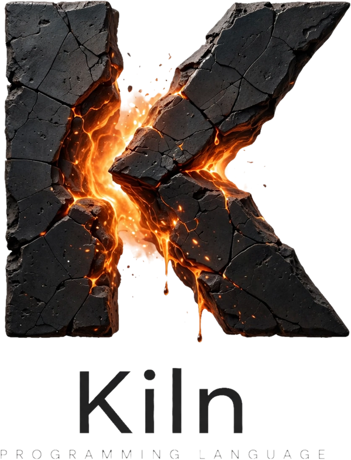

<div align="center">
  
</div>

# Introduction

A **C#-shaped language** and form designer that compiles to one native binary —
no runtime, no .NET, no metadata to reverse.

You lay a window out visually, set properties in an inspector, wire a button's
click to a method, and press **Run** — and what comes out is an ordinary
native binary you can hand to someone.


The language is English-first, C#-shaped and deliberately small. Types are
checked when you build, there are no pointers and no manual memory management,
and there is no ceremony:

```k2
namespace Hello;

Console.WriteLine("Hello from Kiln.");

let answer = 6 * 7;
Console.WriteLine($"six times seven is {answer}");
```

`=` assigns and `==` compares, so a comparison can never silently store a
value.

## What makes it different

**The visual designer is not a separate tool.** The form you draw and the file
you edit are the same thing. Drag a button in the designer and the source
changes; edit the source and the canvas follows.

**Programs are ordinary native binaries.** Your project is compiled to machine
code and linked with the system linker. Nothing is unpacked at startup, no
support libraries are loaded at run time, and there is no interpreter inside.
Programs stay small, start immediately, and look unremarkable to antivirus
software.

**One project builds every artifact.** The same source can become a console
program, a windowed program, a shared library or a static library — a build
option rather than a rewrite. See [Build targets](./build-targets.md).

**A program that waits needs no window.** A timer or an HTTP server is a
component with no rectangle, declared beside the form or without one, and the
runtime's event loop keeps the program alive while any such source is live.
See [Components](./components.md).

## Where this came from

Kiln 1.x was an open implementation of Easy Programming Language (易语言, EPL) —
a RAD environment where you build desktop software by drawing it. That version
still builds and its [language guide](./language.md) still applies to it.

Kiln 2, the language documented here and the one `kiln build` uses, is a
different language: C#-shaped, with classes, records, interfaces, generics and
`Result<T>` instead of exceptions. It is not a wrapper around EPL or C#, does
not read or run existing EPL programs, and compiles to an ordinary native
executable on an open, cross-platform, inspectable toolchain.

## Where to start

- [Installation](./installation.md) — download or build it
- [Quick start](./quick-start.md) — a program in about a minute
- [Your first GUI app](./first-gui-app.md) — draw a window and wire a button
- [Kiln 2](./kiln-2.md) — the whole language, in the order you meet it: values,
  choosing and repeating, records and classes, collections, generics, and what
  happens when something fails

## What is not here yet

[Limitations](./limitations.md) lists what does not exist yet, plainly — it is worth reading before you plan anything around it.
